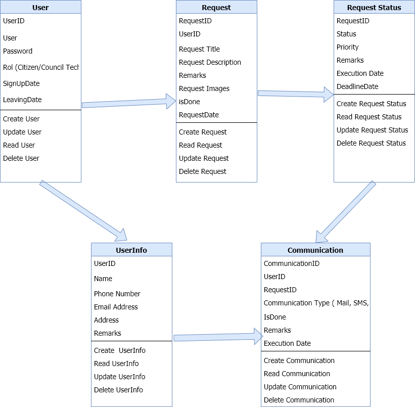

# Some code for Pirple projects

<!-- What is object oriented programming, and why would you use it? As you may already know,
 many javascript projects are written using a functional, or event-driven design pattern. 
 n which cases would an OOP pattern be a better choice?

For this task, write a few paragraphs describing a project that would benefit greatly from
 an OOP structure. (This could be any kind of application, running on any type of system). 
 Describe the application flow from the user's point of view (user stories).
  What is the application's purpose, and how would people use it? What information would they 
  enter, and what would be received? Try to mention all the "stories" in which the user performs 
  any kind of CRUD operation.

Next, using pseudocode (or any other notation-technique or diagramming tool you wish), 
map out what the main objects of the system would look like, how they would be constructed, and how 
they would relate to each other. 

Save your writeup in a Readme.md file, and push it to Github. -->

<h1>What is OOP?</h1>

OOP is defined as a **programming paradigm**, a specific way of programming, where the code is organized in units called classes, from which objects that are related to each other are created to achieve the objectives of the applications.
Object Oriented Programming is a special way of programming, closer to how we would express things in real life than other types of programming.

Thinking objects is very similar to how we would make it in real life. For instance, simple sample : let's think of a car to try to model it in a OOP scheme. The car is the main element with many characteristics, such as color, model or brand. It also has many associated functionalities, such as starting, stopping or parking.

 <a href="https://en.wikipedia.org/wiki/Object-oriented_programming"> This is a Wikipedia entry </a>

<h1></h1>
<h2> Building a Simple OOP Application</h2>

<h2>Purpose</h2>

We can use for instance to build a small webSite to manage citizen request by local city hall. Application will connect citizens with town hall administration service.

Users will be able to register their requests focused on making improvements for their city or to solve any problems related to their community.

The administration's request responses will be public and visible to everyone so that this information can help others. No personal data of citizens will be displayed on the public application.
<h1></h1>
<h2>Application User Flow:</h2>

1. The citizen / users must be registered in the application/system with their email and fill in some contact information. (**User & UserInfo Entities**)

2. Once registered in the system, the citizen can make his query or request (**Request Entity**)

3. The query will be stored and categorized in the system to assign it a priority of attention. (**Request & Request Status Entities**)

4. A technician from the city council will attend to the request and will respond to the citizen. (**Request & Request Status Entities Entities** )

5. A communication will be sent to the citizens indicating that his request has been solved. (**Communication Entity**)

6. The citizen may assess the resolution of their request or even reopen it in the event that it is not resolved.(**Request & Request Status Entities**)

7. The information will be visible to all users of the application without showing personal data. (**Request & Request Status  Entities**)
<h1></h1>
<h2>User App Flow</h2>

 

<h2>Application samples</h2> 

<h2>Sample 1:</h2> 

>- A citizen detects that a street in his neighborhood has a hole in the ground, and someone could fall in.
>
>- The citizen opens the application and validate with his credentials.
>
>- The citizen creates alerted request of this incident on the street. The citizen includes information on where to find the problem:
  Address, photos, description etc.
>
>- The request is stored in the system and an algorithm assigns a resolution priority. (one to five => highest to lowest severity).
>
>- A technician from the town hall attends to the request, responding to the user and trying to solve the problem.
>
>- The Technician sends the street maintenance service to cover the hole.
>
>- The hole is covered and the incident solved, the technician adds this information to the user request.
>
>- The information is read by the user and values ​​the performance of his town hall.

<h1></h1>
<h2> Sample 2:</h2> 

>- A citizen observes that near the playground there are several dogs without an owner.
>
>- The citizen opens the application and validate with his credentials.
>
>- The citizen creates new request about this issue. The citizen includes information on where to find the problem.
  Address, photos, etc. and a short description
>
>- The request is stored in the system and an algorithm assigns a resolution priority. (one to five => highest to lowest severity).
>
>- A technician from the town hall attends the request, responding to the user and trying to solve the problem.
>
>- The Technician sends to the animal protection service to capture and move to Dogs protection House.
>
>- The dogs are collected from the playground and taken to an animal protection center, the technician adds this 
information to the user's request.
>
>- The information is read by the user and evaluate ​​the performance of his town hall.

